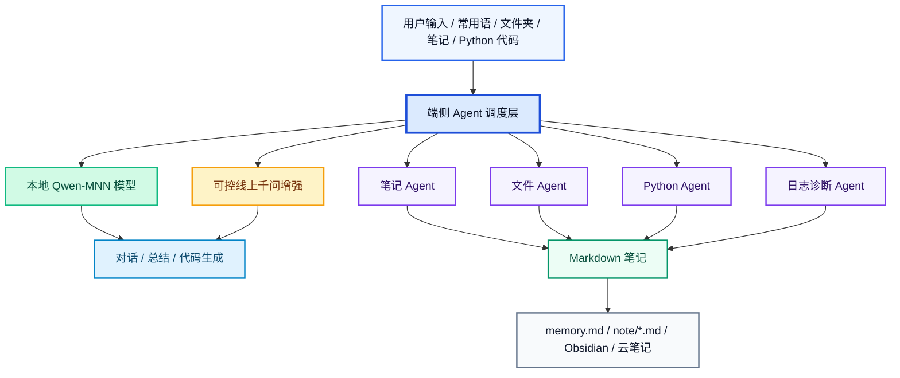
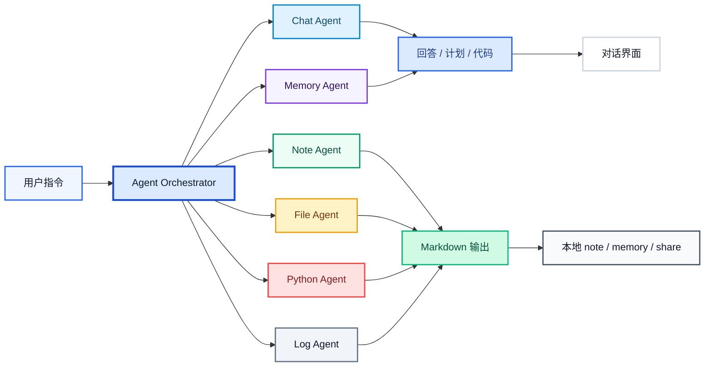
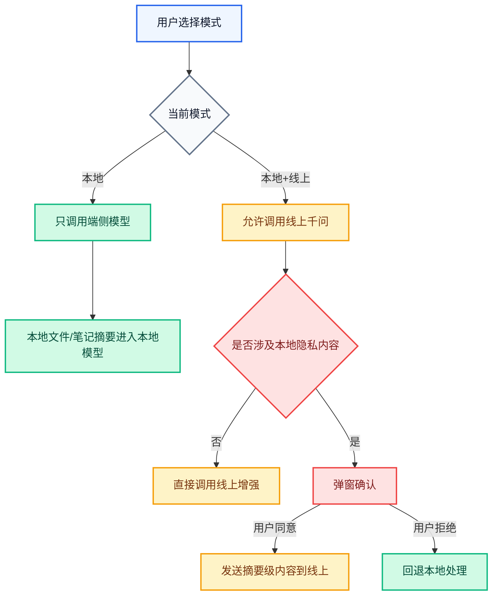
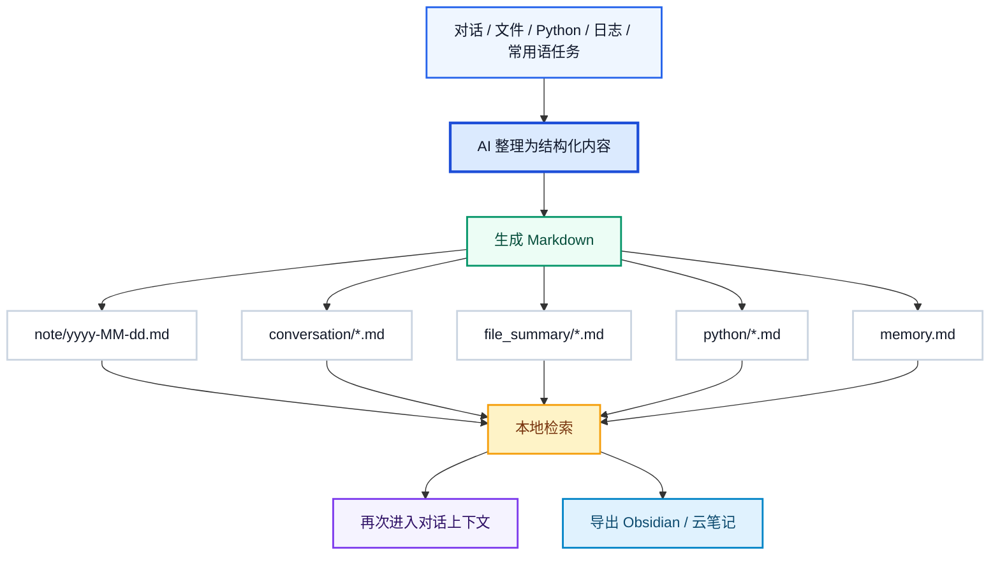
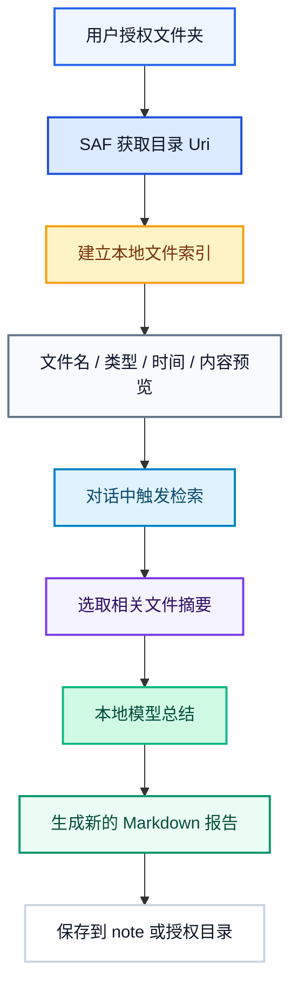
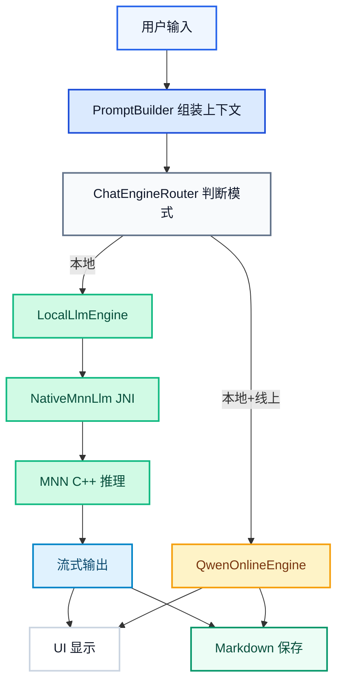
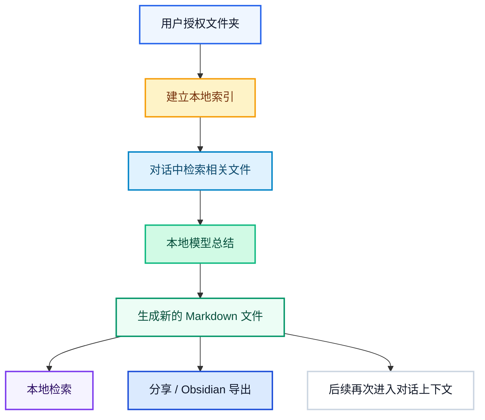

# 手机上的 Codex — 本地智能助手 / PocketDesk AI

> **隐私不出域的手机端侧 Agent 工作台**：把本地对话、Markdown 笔记、长期记忆、本地文件检索、Python 小工具和可控线上增强收拢到手机里，让手机不只是内容消费设备，而是一个可执行、可沉淀、可检索、可持续进化的个人 AI 工作台。

## 1. 项目简介

**手机上的 Codex — 本地智能助手 / PocketDesk AI** 是一款面向个人使用的 Android 端侧 AI Agent 应用。它以“本地优先、隐私可控、可记忆、可沉淀、可执行”为核心设计原则，把手机从普通聊天入口升级为一个随身 AI 操作台。

它不是一个单纯调用大模型接口的聊天壳，而是一个面向真实手机工作流的本地化 Agent 系统：用户可以对话、生成笔记、检索本地文件、运行轻量 Python、小程序化执行任务，并把每天的大模型对话和思考沉淀为可迁移的 Markdown 文件。

app界面

本地调用千问大模型，可以一键将代码导入手机的Python实现多种功能

当前版本已经实现或形成稳定雏形：

- **本地 AI 对话**：内置 Qwen-MNN 端侧模型，支持离线文本对话。
- **本地 + 线上双模式**：默认本地运行，用户主动切换后可调用线上千问 API 增强复杂任务。
- **端侧 Agent 调度**：通过对话 Agent、笔记 Agent、文件 Agent、Python Agent、日志 Agent 协同完成任务。
- **Markdown 笔记沉淀**：对话、整理结果、Python 运行记录、文件摘要均可保存为 `.md` 文件。
- **长期记忆 memory.md**：用户可以导入自己的技术画像、偏好、项目背景，让 AI 提供更贴合个人的建议。
- **本地文件检索与整理**：用户授权文件夹后，AI 可在本地读取、检索和总结文件，不默认修改原文件。
- **Python 小工具**：支持手机端运行轻量 Python 代码，让 AI 不只“回答”，还能辅助计算、处理文本和验证小脚本。
- **错误日志与自诊断**：保留运行日志、模型日志、崩溃日志、性能日志和 Python 日志，方便本地排障。
- **Obsidian / 云笔记友好**：生成的 Markdown 可复制、分享或导出，便于同步到 Obsidian、云笔记或个人知识库。

项目希望回答一个问题：**如果手机本身也能拥有一个本地 AI Agent，它应该如何理解用户、管理文件、沉淀知识并执行小任务？**

## 2. 项目愿景

未来的 AI 产品不应该只停留在“问一句、答一句”。真正有价值的个人 AI 助手，应该能进入用户自己的数据域，理解用户的长期目标、项目背景、文件体系和笔记系统，并在用户授权和可控边界内持续工作。

**PocketDesk AI 的愿景是：**

> 让每个人都拥有一个隐私不出域、可长期记忆、可检索文件、可沉淀知识、可执行小任务的手机端侧 Agent，让手机具备类似“个人 Codex”的执行与整理能力。

它希望成为用户的：

- **私人 AI 助手**：理解用户身份、偏好、项目和长期目标。
- **手机端侧 Agent 中枢**：将对话、文件、笔记、Python、日志和小程序能力统一调度。
- **本地文件助理**：帮助检索、总结和整理手机文件夹中的文档、照片、微信文件和项目资料。
- **Markdown 知识中枢**：把大模型对话中的关键知识沉淀为可迁移、可检索、可复用的 `.md` 文件。
- **手机端轻量 Codex**：让 AI 生成简单 Python，并在手机上本地运行。
- **个人数据入口**：未来可连接更多手机本地数据，如图片、录音、文档、笔记、日志和项目文件。

核心理念是：

**不是把隐私数据上传给 AI，而是让 AI 在用户授权的本地数据域内工作。**

## 3. 为什么做这个项目

很多闭源大模型 App 虽然强大，但存在几个长期痛点：

1. **对话难沉淀**  
   很多关键思路、技术判断、项目复盘都留在聊天记录里，难以导出、难以二次检索，也难以长期积累。

2. **个人画像不可控**  
   模型记住了什么、忘记了什么，用户往往看不见、改不了、迁移不了。

3. **手机文件体系复杂**  
   微信文档、下载文件、项目资料、照片、笔记分散在不同目录，普通用户很难快速检索和整理。

4. **隐私与效率难兼得**  
   直接上传文件给云端模型效率高，但对个人资料、工作文档、技术方案和隐私数据并不安全。

5. **AI 只会说，不会做**  
   很多手机端 AI 仍停留在问答层面，缺少本地小工具、代码执行和文件整理能力。

6. **移动端缺少真正的 Agent 工作流**  
   手机上有大量个人数据和真实场景，但很多 AI App 只是对话入口，没有形成可执行、可检索、可沉淀的端侧 Agent 链路。

PocketDesk AI 试图解决这些问题：  
**让 AI 对话、长期记忆、文件检索、Markdown 笔记和 Python 小工具在手机本地形成闭环。**

## 4. 面向比赛的定位

本项目适合“为智能世界打造操作系统与开发工具”的方向。它不是追求单个模型指标，而是探索一种**手机端侧 Agent 工作流**。

可以理解为：

**一个面向个人的手机端 AI Agent 操作台，也可以理解为“手机上的 Codex”。**

它关注的不只是模型能力，而是：

- AI 如何进入真实手机工作流；
- AI 如何处理个人文件和笔记；
- AI 如何保护隐私边界；
- AI 如何把一次性回答变成长期资产；
- AI 如何从“聊天助手”进化为“端侧工作台”；
- AI 如何在移动设备上完成简单任务执行与知识沉淀。

## 5. 核心功能

### 5.1 本地 AI 对话

- 内置 Qwen-MNN 本地模型。
- 支持离线运行。
- 支持中文优先回答。
- 支持结构化输出、Markdown 输出和代码块显示。
- 支持本地模式 / 本地+线上模式切换。
- 支持常用语快捷入口，让用户快速触发 Python 生成、旧笔记冒泡、对话整理等任务。

### 5.2 手机端侧 Agent 调度

PocketDesk AI 的核心不是单一聊天页面，而是一个轻量 Agent 系统。不同能力被拆分为独立 Agent，由统一入口调度。

| Agent | 作用 | 典型任务 |
| --- | --- | --- |
| Chat Agent | 对话与任务理解 | 回答问题、生成方案、组织 Prompt |
| Memory Agent | 长期记忆管理 | 读取 memory.md、生成记忆候选 |
| Note Agent | 笔记沉淀 | 对话转 Markdown、日报、旧笔记冒泡 |
| File Agent | 本地文件检索 | 文件名搜索、文本预览、文件摘要 |
| Python Agent | 本地代码执行 | 运行轻量 Python、保存结果 |
| Log Agent | 自诊断 | 分析运行日志、模型日志、Python 日志 |
| Online Agent | 可控线上增强 | 用户确认后调用千问 API |

端侧 Agent 的任务链路如下：

### 5.3 本地 + 线上双模式

| 模式 | 说明 | 适用场景 |
| --- | --- | --- |
| 本地 | 默认模式，使用端侧模型，隐私不出域 | 私人信息、文件检索、短文本整理 |
| 本地 + 线上 | 用户主动切换后调用千问 API | 长文本推理、复杂规划、高质量生成 |

设计原则：

- 默认不联网；
- 用户主动切换才调用线上；
- 本地文件和笔记内容默认不上传；
- 如需发送本地摘要到线上，应由用户确认；
- 本地和线上对话上下文隔离，避免端侧模型被超长上下文压垮。

隐私边界流程：

### 5.4 Markdown 笔记中枢

PocketDesk AI 会把重要内容沉淀为 Markdown：

- 每日对话笔记；
- 用户手动新建笔记；
- 对话摘要笔记；
- Python 运行记录；
- 文件摘要报告；
- 每日工作日报；
- memory.md 长期记忆。

这让用户可以：

- 本地检索；
- 复制分享；
- 上传云笔记；
- 一键导入 Obsidian；
- 后续再次被 AI 读取和分析。

Markdown 生命周期如下：

### 5.5 memory.md 可控长期记忆

用户可以把自己的信息、偏好和项目背景写入 `memory.md`，例如：

- 身份背景；
- 当前项目；
- 技术方向；
- 回答偏好；
- 长期目标；
- 待办事项。

AI 可以读取这些信息，从而给出更贴近用户个人情况的建议。

更重要的是：  
**memory.md 是用户可见、可编辑、可迁移的，不是黑箱记忆。**

### 5.6 本地文件检索与整理

用户可以授权一个文件夹，App 只在该文件夹内读取和检索文件。

支持方向：

- 文件名检索；
- 文本文件内容检索；
- Markdown / txt / json / csv / 代码文件摘要；
- 文件分布统计；
- 生成文件整理建议；
- 新建 Markdown 摘要文件。

隐私边界：

- 不读取全手机文件；
- 不申请全盘管理权限；
- 不默认修改、覆盖、删除、移动用户已有文件；
- 默认只读取和新建结果文件；
- 隐私数据默认只给本地模型使用。

这让用户可以用对话方式管理本地文件，例如：

- “帮我找最近和 APK 项目有关的文档。”
- “总结这个文件夹里的 Markdown 笔记。”
- “看看日志文件里最近有什么异常。”
- “帮我生成一个文件夹整理建议。”

文件 Agent 工作流如下：

### 5.7 Python 小工具

小程序中集成轻量 Python 工具：

- 用户可以输入 Python 代码；
- AI 可生成可运行的小脚本；
- 支持标准库级别的计算、文本处理、JSON/CSV 处理；
- 运行结果可保存为 Markdown 笔记。

典型用途：

- 随机选择；
- 文本清洗；
- JSON 格式化；
- 简单统计；
- 正则提取；
- 小型计算验证。

这使 PocketDesk AI 具备“说 + 算 + 记”的闭环能力。

Python Agent 流程如下：

```mermaid
flowchart LR
    A[用户：生成 Python 小工具] --> B[Chat Agent 生成代码块]
    B --> C[用户手动导入]
    C --> D[Python Agent 本地运行]
    D --> E{运行结果}
    E -->|成功| F[stdout 输出]
    E -->|异常| G[traceback 错误]
    F --> H[保存到 Markdown]
    G --> H
    H --> I[note/python/*.md]

    class A input
    class B chat
    class C human
    class D python
    class E decision
    class F success
    class G error
    class H markdown
    class I storage

    classDef input fill:#EFF6FF,stroke:#2563EB,color:#0F172A,stroke-width:2px
    classDef chat fill:#E0F2FE,stroke:#0284C7,color:#0C4A6E,stroke-width:2px
    classDef human fill:#FFFFFF,stroke:#CBD5E1,color:#111827,stroke-width:2px
    classDef python fill:#FEF3C7,stroke:#F59E0B,color:#78350F,stroke-width:2px
    classDef decision fill:#F8FAFC,stroke:#64748B,color:#0F172A,stroke-width:2px
    classDef success fill:#D1FAE5,stroke:#10B981,color:#064E3B,stroke-width:2px
    classDef error fill:#FEE2E2,stroke:#EF4444,color:#7F1D1D,stroke-width:2px
    classDef markdown fill:#ECFDF5,stroke:#059669,color:#064E3B,stroke-width:2px
    classDef storage fill:#F8FAFC,stroke:#475569,color:#0F172A,stroke-width:2px
```

### 5.8 小程序与快捷指令

当前小程序包括：

- 吃什么大转盘；
- Python 小工具；
- 文件助理；
- 常用语 / Prompt 工具卡。

常用语入口可快速插入：

- 生成 Python 小工具；
- 根据我的信息给建议；
- 随机冒泡一份旧笔记；
- 给我 5 条具体建议；
- 对话整理成 Markdown 笔记。

其中“随机冒泡一份旧笔记”用于让久远笔记重新浮现，防止用户忘记过去沉淀的知识。

### 5.9 日志系统与自诊断

App 内置多类日志：

- 运行日志；
- 模型日志；
- 崩溃日志；
- 性能日志；
- 线上 API 日志；
- Python 日志；
- 文件检索日志。

这些日志可以帮助用户和开发者定位：

- 本地模型是否加载成功；
- native 层是否崩溃；
- 线上 API 是否调用成功；
- Python 是否运行异常；
- 文件检索是否读取成功。

这也体现了项目的工程可诊断性，而不只是一次性 Demo。

## 6. 技术架构

### 6.1 总体架构

```mermaid
flowchart TD
    subgraph UI[UI 层：Jetpack Compose]
        A1[ChatScreen 对话]
        A2[NotesScreen 笔记]
        A3[MiniAppsScreen 小程序]
        A4[ErrorLogScreen 日志]
        A5[FileSearchScreen 文件检索]
    end

    subgraph VM[状态与调度层]
        B1[ChatViewModel]
        B2[ChatEngineRouter]
        B3[PromptBuilder]
    end

    subgraph AGENT[端侧 Agent 能力层]
        C1[Chat Agent]
        C2[Memory Agent]
        C3[Note Agent]
        C4[File Agent]
        C5[Python Agent]
        C6[Log Agent]
    end

    subgraph ENGINE[模型与执行层]
        D1[LocalLlmEngine]
        D2[NativeMnnLlm JNI]
        D3[MNN C++ Runtime]
        D4[QwenOnlineEngine]
        D5[Chaquopy Python]
    end

    subgraph DATA[本地数据层]
        E1[memory.md]
        E2[note/*.md]
        E3[file_index.json]
        E4[logs/*.log]
        E5[workspace]
    end

    UI --> VM
    VM --> AGENT
    AGENT --> ENGINE
    AGENT --> DATA
    ENGINE --> DATA

    class A1,A2,A3,A4,A5 uiNode
    class B1,B2,B3 vmNode
    class C1,C2,C3,C4,C5,C6 agentNode
    class D1,D2,D3,D4,D5 engineNode
    class E1,E2,E3,E4,E5 dataNode

    style UI fill:#EFF6FF,stroke:#2563EB,color:#0F172A,stroke-width:2px
    style VM fill:#DBEAFE,stroke:#1D4ED8,color:#0F172A,stroke-width:2px
    style AGENT fill:#F5F3FF,stroke:#7C3AED,color:#2E1065,stroke-width:2px
    style ENGINE fill:#FEF3C7,stroke:#F59E0B,color:#78350F,stroke-width:2px
    style DATA fill:#ECFDF5,stroke:#059669,color:#064E3B,stroke-width:2px

    classDef uiNode fill:#FFFFFF,stroke:#60A5FA,color:#0F172A,stroke-width:1.5px
    classDef vmNode fill:#FFFFFF,stroke:#2563EB,color:#0F172A,stroke-width:1.5px
    classDef agentNode fill:#FFFFFF,stroke:#7C3AED,color:#2E1065,stroke-width:1.5px
    classDef engineNode fill:#FFFFFF,stroke:#F59E0B,color:#78350F,stroke-width:1.5px
    classDef dataNode fill:#FFFFFF,stroke:#10B981,color:#064E3B,stroke-width:1.5px
```

### 6.2 技术栈

| 模块 | 技术 |
| --- | --- |
| Android 开发 | Kotlin |
| UI | Jetpack Compose + Material 3 |
| 本地推理 | MNN |
| 本地模型 | Qwen3.5-0.8B-MNN |
| 线上增强 | 千问 OpenAI 兼容接口 |
| Python 执行 | Chaquopy |
| 文件访问 | Android Storage Access Framework |
| 笔记格式 | Markdown |
| 架构模式 | MVVM + Repository + 端侧 Agent |
| 日志 | App 内部分层日志 |

### 6.3 本地模型链路

### 6.4 文件与笔记链路

## 7. 项目亮点

### 7.1 隐私不出域

用户的个人信息、笔记和文件默认只在本机处理。AI 不是远程读取用户数据，而是在授权范围内本地工作。

### 7.2 手机端侧 Agent

项目把聊天、记忆、笔记、文件、Python 和日志拆成多个可扩展 Agent，使手机具备“感知本地数据、执行轻量任务、沉淀结果”的能力。

### 7.3 可控记忆

记忆不再是黑箱，而是可见、可编辑、可备份的 `memory.md`。

### 7.4 Markdown 全链路

对话、总结、报告、Python 结果和长期记忆都以 Markdown 沉淀，方便用户迁移到 Obsidian、云笔记或 GitHub。

### 7.5 手机端文件 AI 助理

通过文件夹授权和本地检索，让用户用自然语言管理复杂文件体系。

### 7.6 掌上轻量 Codex

模型生成 Python，手机本地运行，结果保存到笔记。  
这使 AI 不只是回答问题，还能执行轻量任务。

### 7.7 可诊断工程系统

内置日志、崩溃记录和性能记录，适合持续迭代和真实设备测试。

## 8. 当前已完成能力

- Android APK 可运行；
- 本地 Qwen-MNN 模型对话；
- 本地 / 本地+线上切换；
- Markdown 历史笔记；
- memory.md 长期记忆；
- Python 小工具；
- 小程序页面；
- 错误日志页面；
- 文件检索与整理方向已接入 / 规划中；
- GUI 已统一为科技蓝、浅蓝、白色、冷灰风格；
- App 名称统一为：**本地智能助手 / PocketDesk AI**。

## 9. 典型使用场景

### 场景一：个人技术画像助手

用户导入自己的 `memory.md`，AI 了解用户的专业方向、项目背景和回答偏好，给出更定制化的建议。

### 场景二：手机文件检索助手

用户授权一个文件夹，AI 可帮助检索文件名、总结 Markdown、分析日志、整理项目资料。

### 场景三：对话沉淀为知识资产

每次大模型对话不再只是临时聊天，而是自动保存为 Markdown，成为可检索、可导出的技术笔记。

### 场景四：旧笔记冒泡

AI 随机选取久远笔记进行总结，让用户重新看到过去的想法、方案和经验，防止知识沉没。

### 场景五：手机端 Python 小工具

AI 生成一段标准库 Python，用户在手机上运行，完成小计算、小统计、小文本处理，并保存结果。

### 场景六：端侧 Agent 工作流

用户可以用一句话触发复杂流程：

> “帮我查找最近 APK 项目相关文件，总结关键内容，生成一份 Markdown 报告，并给出下一步建议。”

App 可以在授权边界内完成：文件检索 → 摘要生成 → Markdown 保存 → 对话展示 → 后续追问。

## 10. 参赛内容对齐

### 10.1 如果没有任何成本限制，我最想做的 AI 产品

我想做一个真正运行在个人设备上的 **本地智能助手 / PocketDesk AI**。

它不是一个只能聊天的 App，而是一个个人手机里的 AI 工作台：能理解用户画像，检索本地文件，总结笔记，运行小脚本，整理每天的大模型对话，并把所有结果沉淀为 Markdown。它可以连接用户授权的数据域，包括笔记、文档、照片、项目文件、日志和手机本地资料，帮助用户把碎片化信息变成可检索、可复用、可沉淀的个人知识系统。

更重要的是，它默认隐私不出域。用户的数据不应该天然被上传到云端，AI 应该可以在用户自己的设备和授权空间内工作。

### 10.2 我认为什么样的 AI 作品才真正有 taste

我认为真正有 taste 的 AI 作品，不是简单套一个大模型接口，也不是堆很多华丽功能，而是能进入真实用户工作流，解决一个长期存在但被忽视的问题。

一个有 taste 的 AI 作品应该具备：

- 清晰的问题意识；
- 克制而稳定的工程实现；
- 对用户数据和隐私的尊重；
- 能把一次性生成变成长期资产；
- 能让用户持续复用，而不是只体验一次新鲜感；
- 有自己的产品哲学，而不是只展示模型能力。

PocketDesk AI 的核心 taste 在于：  
**它让手机端 AI 从“聊天窗口”变成“个人本地端侧 Agent 工作台”。**

### 10.3 相关履历

本人具有自然科学博士背景，长期关注 AI for Science、机器学习算法、传感器数据分析和端侧 AI 工程化。过往项目经历包括数据清洗、特征工程、模型训练、参数调优、SHAP 可解释性分析、PyQt5 工具化部署、Android APK 开发、本地模型部署和自动化分析系统构建。

当前关注方向是将大模型能力与真实工程工作流结合，让 AI 不只停留在问答层，而是能够进入文件、笔记、代码、小工具和长期记忆系统中，形成可复用、可积累、可展示的个人技术资产。

## 11. 未来路线

### 11.1 短期

- 完善文件助理；
- 完善笔记中心；
- 加强 Markdown 渲染；
- 提升本地模型稳定性；
- 优化本地 / 线上切换边界；
- 增加 Prompt 工具卡；
- 完善 Obsidian 导出。

### 11.2 中期

- 本地笔记全文检索；
- 文件摘要索引；
- 记忆候选机制；
- 日志自解释；
- 每日工作日报；
- 项目文件夹摘要页；
- 常用小程序工具箱。

### 11.3 长期

- 构建手机端个人 AI 操作系统雏形；
- 支持多模态输入，如图片、语音、截图；
- 支持更多本地模型；
- 支持更多本地数据源；
- 支持更强的端侧隐私保护和权限控制；
- 将手机变成真正的个人 AI 中枢。

## 12. 项目总结

**手机上的 Codex — 本地智能助手 / PocketDesk AI** 的目标，是让 AI 真正进入个人手机的本地工作流。

它把本地大模型、Markdown 笔记、长期记忆、文件检索、Python 小工具、端侧 Agent 调度和可控线上增强整合到一个移动端 AI 工作台中。用户可以把自己的技术画像、项目背景、文件夹和日常对话逐步沉淀下来，形成一个可检索、可迁移、可复用的个人知识与任务系统。

它的价值不在于替代云端大模型，而在于探索一种更可控、更私有、更贴近个人数据域的 AI 使用方式：

**让 AI 留在用户身边，让数据留在用户手里，让每一次对话都能变成长期资产。**
